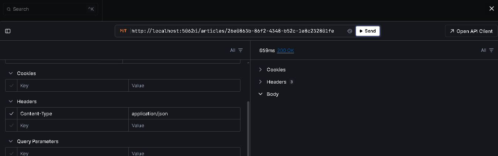

## Using Clean Architecture with MediatR in .Net

1. Domain
2. Application
3. Persistence / Infrastructure
4. Api

**For Database Migration**:

```bash
> cd src/External/Persistence
> dotnet ef migrations add InitialCreate --startup-project ../Api/Api.csproj
```




