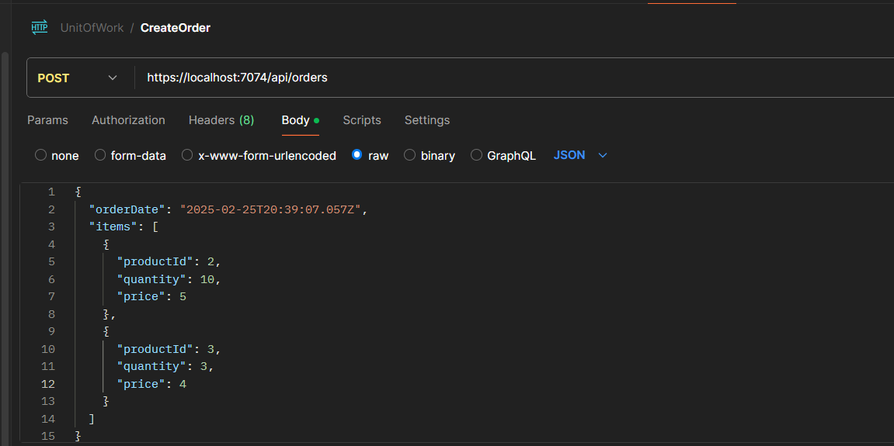

# Using UnitofWork and Generic Repostitory Pattern

This project demonstrates the implementation of Clean Architecture using the Unit of Work and Repository patterns in .NET. It provides a robust foundation for building scalable and maintainable applications.

## Table of Contents
- [Architecture Overview](#architecture-overview)
- [Design Patterns](#design-patterns)
- [Project Structure](#project-structure)
- [Implementation Details](#implementation-details)
- [Usage Examples](#usage-examples)
- [Getting Started](#getting-started)

## Architecture Overview

The solution follows Clean Architecture principles with the following layers:
- **Domain**: Contains business entities and specifications
- **Application**: Contains business logic and interfaces
- **Infrastructure**: Contains data access and external concerns
- **API**: Contains API endpoints and controllers

## Design Patterns

### Unit of Work Pattern
The Unit of Work pattern maintains a list of objects affected by a business transaction and coordinates the writing out of changes. Benefits include:
- Maintains database consistency
- Reduces database round trips
- Manages transactions effectively

## Repository Pattern
The Repository pattern abstracts the data persistence logic, providing a more object-oriented view of the persistence layer. Benefits include:

 - Centralizes data access logic
 - Provides consistent access to data
 - Enables unit testing through abstraction

## Specification Pattern
The Specification pattern enables us to encapsulate query logic and make it reusable. Benefits include:

 - Reusable query logic
 - Composable queries
 - Clean and maintainable code

### Endpoints

- Create Order Request:

- Create Order Response:

- Get Order by Id:

