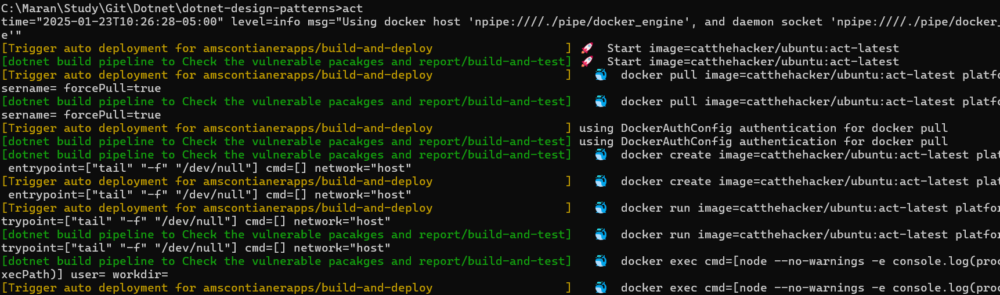
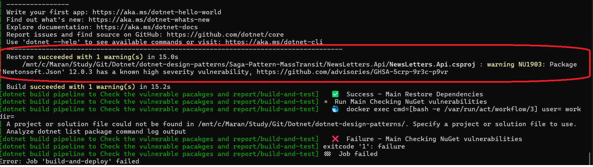

# SAGA PATTERN With Mass Transit State machine


## CI for checking the Nuget package vulnerabilities.
- Created a CI github action pipeline to check the Vulnerable Nuget pacakages.
- Used the below command in the CI/CD Actions job
- As the repository contains multiple Solutions, used Path filter to run the actions only when this Solution's project are checked-in.


    ```bash
    > dotnet list package --vulnerable --include-transitive
    ```

- For local testing used the ACT.
   - Need to have Docker Desktop running. ACT will use a docker image.

   

   


