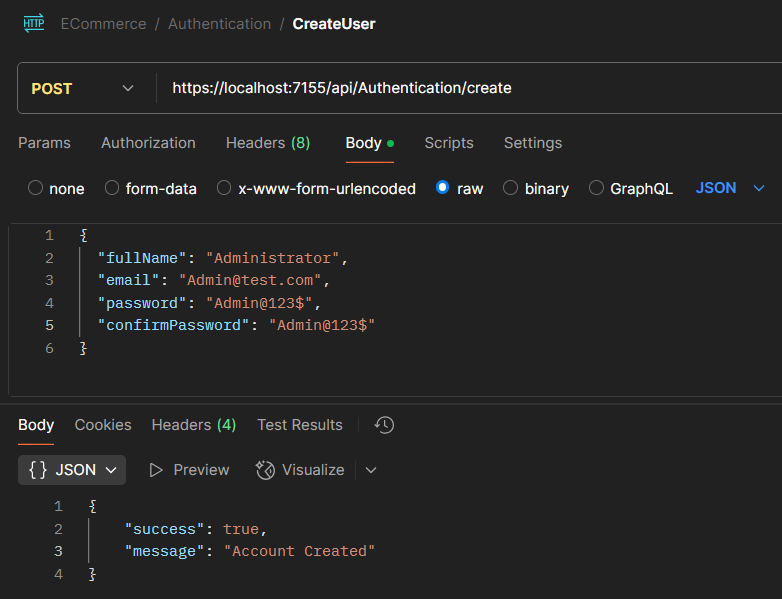

To Run the Migration
1. Route to the .\eCommerceApp.Infrastructure project in the package manager project.

```bash
> dotnet ef migrations add AuthenticationAdded -s ../eCommerceApp.Host/eCommerceApp.Host.csproj
```

2. If the migration was wrongly applied and database is not updated yet
   - Delete the existing migration files from your project.
   - Delete XXXXXXXXXXXXXX_<wrongmigrationname>.cs
   - Delete XXXXXXXXXXXXXX_<wrongmigrationname>.Designer.cs

   while deleting the migration files, revert the ModelSnapshot.cs file also, which is in the Migrations folder

3. If the migration is already applied to db and want to revert

```bash
dotnet ef database update 0
```
4. After creating the new migration, apply it to the database. In this project case, we are doing it through code. 
```bash
  dotnet ef database update -s ../eCommerceApp.Host/eCommerceApp.Host.csproj
```

5. Check if there is pending Migration
```bash
dotnet ef migrations has-pending-model-changes -s ../eCommerceApp.Host/eCommerceApp.Host.csproj
```

## Creating a Accounts



## Login with Admin User
